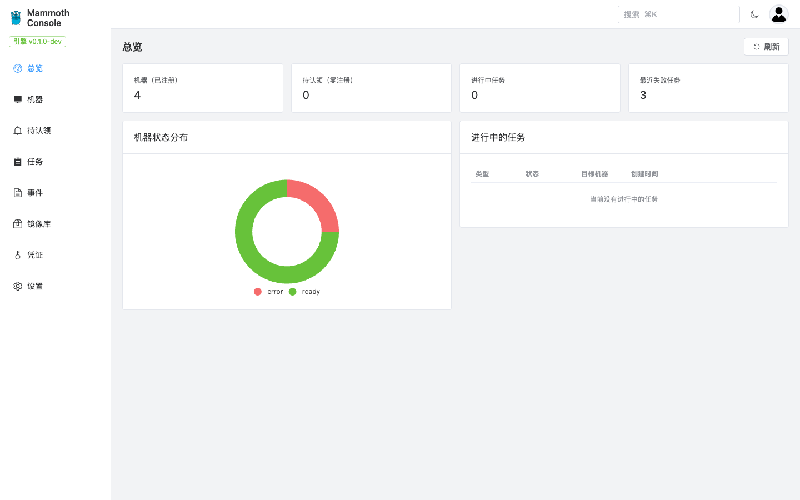
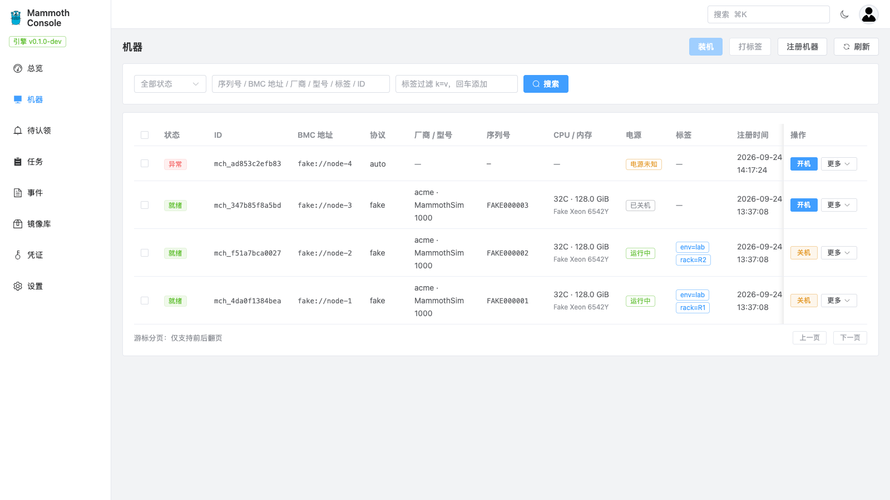
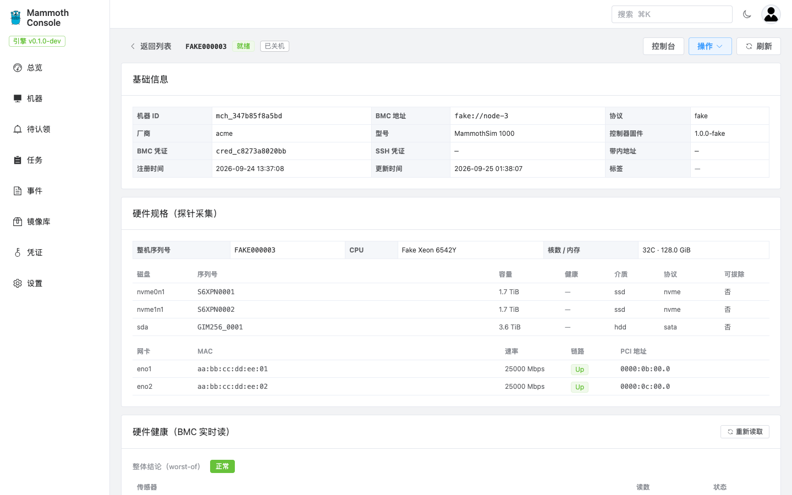
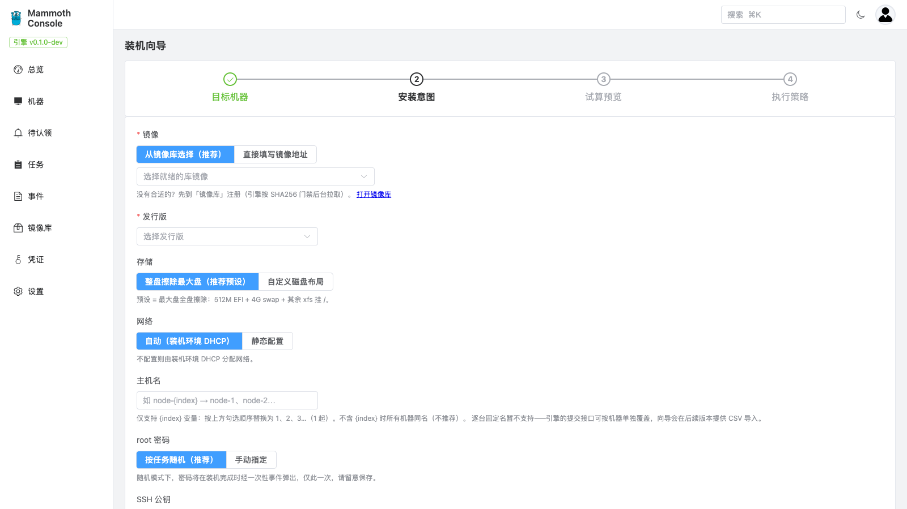
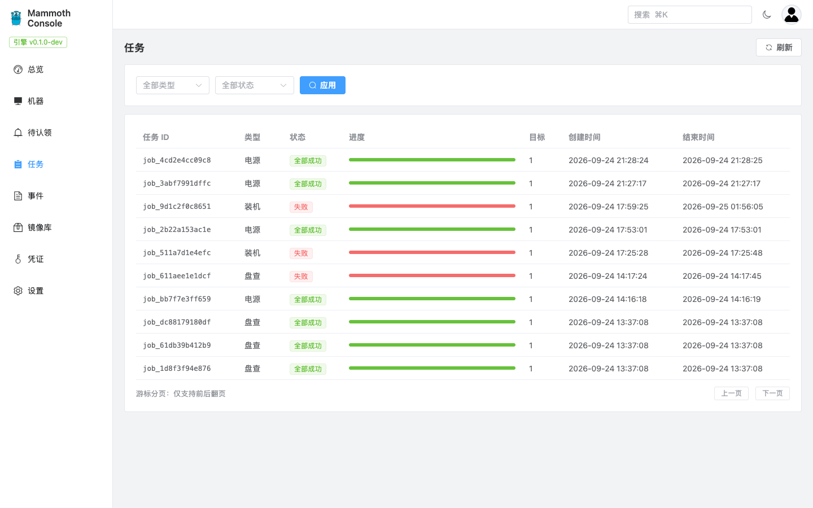
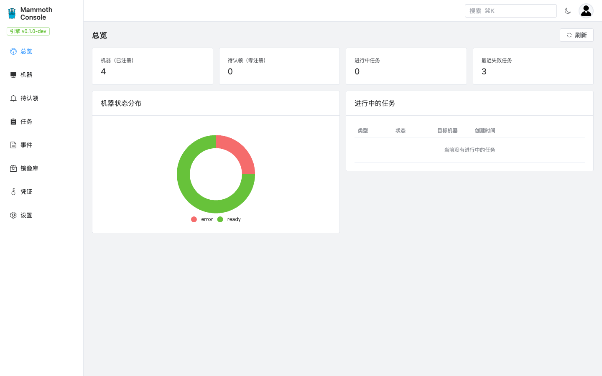

<p align="center">
  
</p>

<h1 align="center">Mammoth Console</h1>

<p align="center">
  The official web console for <a href="https://github.com/3th1nk/mammoth">Mammoth</a> —
  the self-contained bare-metal provisioning engine.<br/>
  <a href="./README.zh-CN.md">中文文档</a>
</p>

Mammoth turns a minimal input — a BMC address and a credential — into a running
server. The engine is backend-only and API-first; this repository is its official
frontend: a single-page console that talks to the engine's public API and nothing
else.

## Highlights

- **Zero private backend** — the engine is the single source of truth. Every
  capability boundary is driven by `GET /api/v1` (capabilities); nothing is
  hard-coded.
- **Full machine lifecycle** — register (with inline credential creation),
  auto-discovery, power/media/boot actions, health & SEL live views, drive and
  BIOS panels with two-stage confirmation wizards, deregistration.
- **Install wizard** — four-step declarative install: machine selection with
  busy precheck, distro image (artifact library or inline), graphical storage
  (RAID-aware) & network (bond/VLAN) composition, package sources, scripts, and
  an install-plan dry-run preview before submit.
- **Live task observation** — job/task SSE, log streaming with replay and
  end-of-stream, retry/cancel, one-time root-password capture.
- **Zero-registration onboarding** — pending-machine sightings feed with badge,
  claim flow, plus an explicit warning when PXE is not enabled on the engine.
- **Built for operators** — event audit with resource/type filters, HMAC-signed
  webhook subscriptions with a grouped searchable type picker, global
  command palette (⌘K), dark mode, fully localized (zh-CN) UI.

## Screenshots

**Dashboard** — machine state distribution, running tasks, onboarding wizard.



**Machines** — state badges, labels, inline power actions, fuzzy search, command palette (⌘K).



**Machine detail** — probed hardware spec (disks / NICs), live BMC health and SEL views.



**Install wizard** — declarative intent: image, storage, network, hostname, credentials, with an install-plan dry run before submit.



**Jobs** — batch progress bars, SSE live task observation, streaming logs with retry/cancel.



**Dark mode** — Element Plus dark variables with a persisted preference.



## Quick start (Docker)

```bash
# Engine on the same docker network (service name `mammoth`):
docker compose -f deploy/compose.yaml up -d --build

# Or engine on the host:
MAMMOTH_UPSTREAM=http://host.docker.internal:8080 docker compose -f deploy/compose.yaml up -d --build
```

Open `http://<host>:8081`, paste the engine's `MAMMOTH_API_TOKEN`, leave the
address empty (same-origin through the bundled Caddy reverse proxy, SSE
pass-through included). After a contract upgrade, regenerate types first
(`npm run gen:api`) and rebuild.

## Local development

```bash
npm install
npm run gen:api   # regenerate API types from ../mammoth/api/openapi.yaml
npm run dev       # http://localhost:5173, /api proxied to 127.0.0.1:8080
npm run build     # vue-tsc typecheck + vite build
```

Point the console at any engine: fill in its API token on the connect screen and
leave the address empty (same-origin via the vite proxy). Distro logo assets are
documented in [assets/logos/MANIFEST.md](./assets/logos/MANIFEST.md).

## End-to-end tests

```bash
npm run e2e       # spins up an isolated engine (separate database, port 8081)
                  # + vite on 5174, runs Playwright, tears down on exit
```

The suite covers connect/rehydrate, the machine lifecycle (register → detail →
batch labels → command palette → deregister), the onboarding wizard, and the
webhook subscription flow. See `e2e/engine.sh` for the isolated engine
environment — database credentials are read from `E2E_PG_*` variables, so the
suite runs against your own disposable PostgreSQL container.

## Documentation

| Document | Content |
|---|---|
| [01-competitive-research](./docs/01-competitive-research.md) | Competitive research: MAAS / Tinkerbell / Foreman / Ironic / Cobbler / Equinix Metal, industry conventions and differentiation |
| [02-engine-capabilities](./docs/02-engine-capabilities.md) | Engine capability survey: entities, state machines, API surface, frontend translation gaps |
| [03-product-design](./docs/03-product-design.md) | Product design: positioning, architecture (SPA + companion reverse proxy), IA, key flows, milestones |
| [04-engine-api-enhancements](./docs/04-engine-api-enhancements.md) | Console-driven engine API enhancements (A1–A7), all landed upstream |

## Tech stack

Vue 3 + TypeScript + Element Plus + TanStack Query · openapi-fetch with
contract-generated types · native SSE wrappers · Vite + vue-tsc · Playwright ·
Caddy for the production container.

## License & trademarks

Apache-2.0 — see [LICENSE](./LICENSE). Distro names and logos (Rocky, CentOS,
Kylin, UOS, Ubuntu, Debian, Alpine) and Windows are trademarks of their
respective owners, used solely to indicate supported distros; no affiliation or
endorsement. Windows is a trademark of Microsoft. See also [NOTICE](./NOTICE).
